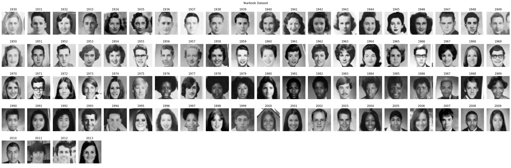

Wild-Time-Data: Easy access to the Wild-Time data
*************************************************

This repository is supposed to provide a simple way to use the
`Wild-Time datasets <https://github.com/huaxiuyao/Wild-Time>`_ for your own experiments.
In contrast to the original repository, this repository features only code relevant for dataset loading,
has fewer and relaxed requirements. Finally, it is addressing some bugs related to data loading that currently
do not allow for downloading the datasets in the original repository.

Licenses
========
All additional code for Wild-Time-Data is available under the Apache 2.0 license.
We list the licenses for each Wild-Time dataset below:

- arXiv: CC0: Public Domain
- Drug-BA: MIT License
- FMoW: `The Functional Map of the World Challenge Public License <https://raw.githubusercontent.com/fMoW/dataset/master/LICENSE>`_
- Huffpost: CC0: Public Domain
- Yearbook: MIT License

Furthermore, this repository is loosely based on the `Wild-Time repository <https://github.com/huaxiuyao/Wild-Time>`_
which is licensed under the MIT License.
